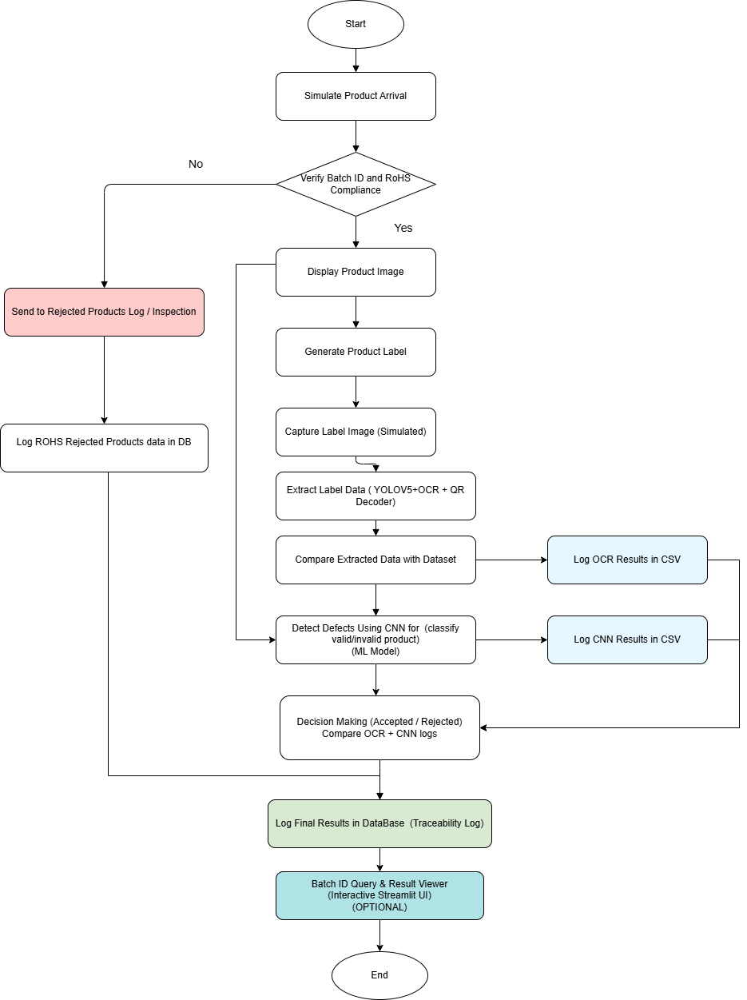
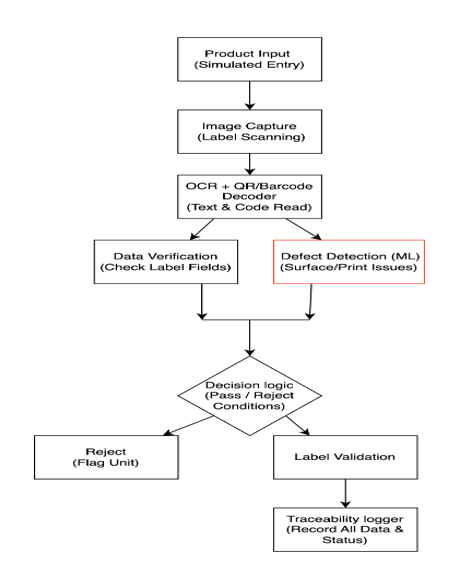
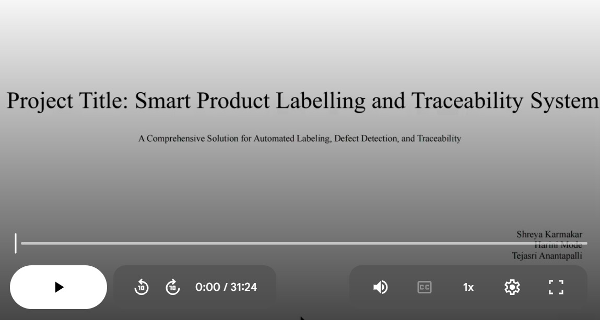

# IntelliTrace-Smart_Traceability_and_Labelling_Framework
An intelligent product traceability and labeling system that integrates YOLOv5-based object detection, OCR, QR/barcode decoding, and ML-based defect detection to automate quality checks and log inspection results using SQLite and Excel.

---

## 📚 Table of Contents
- [🎯 Objective](#-objective)
- [🧩 Problem Description](#-problem-description)
- [ℹ️ About the Project](#about-the-project)
- [⚙️ How It Works](#how-it-works)
- [🔁 Process Flow](#-process-flow)
- [🔍 Technical Details](#-technical-details)
- [🏗️ Architecture Diagram](#-architecture-diagram)
- [🛠️ Key Technologies and Libraries](#-key-technologies-and-libraries)
- [🧪 Dataset and Defect Detection](#-dataset-and-defect-detection)
- [📊 Results Summary](#-results-summary)
- [🖼️ Sample Output Snapshots](#-sample-output-snapshots)
- [▶️ How to Run the Project](#-how-to-run-the-project)
- [📂 Folder Structure](#-folder-structure)
- [📘 Detailed Report](#-detailed-report) 
- [📽️ Video Demonstration](#-)           
- [📊 Project Presentation (PPT)](#-)     
- [👨‍💻 Made by](#-made-by)

---

## 🎯 Objective
To develop an AI-powered smart product inspection and labeling system that automates the end-to-end process of label verification and defect detection. The system simulates product arrival,checks ROHS Compliance, performs object detection, OCR, barcode/QR decoding, and CNN-based defect analysis to validate key manufacturing metadata such as Device ID, Batch ID, Manufacturing Date, and RoHS Compliance. All inspection results and decisions are logged into an SQLite database and Excel report to ensure traceability, enhance quality control, and support efficient manufacturing workflows.


---

## 🧩 Problem Description
In high-volume manufacturing industries like electronics and medical devices, manual label verification is time-consuming and error-prone. This project addresses the challenge of:
- Automating the verification of product metadata from images
- Decoding QR and barcodes accurately
- Detecting surface defects using vision-based methods
- Logging approved/rejected products for traceability

---

## ℹ️ About the Project
This project combines real-time object detection, optical character recognition (OCR), and machine learning to create an intelligent labeling station. It:
- Uses YOLOv5 to detect and extract QR and label regions
- Extracts and validates metadata like Device ID, Batch ID, RoHS compliance
- Uses ResNet18 + PCA + OCSVM to detect visual anomalies
- Stores results in Excel and SQLite databases for traceability<br>

This project is a software-only simulation of an AI-powered smart traceability and labeling station for small electronic products. It automates the inspection process by integrating object detection, OCR, QR/barcode decoding, and machine learning-based defect detection. The system mimics a real-world industrial setup and handles the complete inspection lifecycle, including:<br>

1.Product Arrival Simulation<br>
2.RoHS Compliance Validation<br>
3.QR/Barcode Decoding for metadata extraction<br>
4.Label Detection & Verification using YOLOv5 and EasyOCR<br>
5.Visual Defect Detection using ResNet18 + PCA + One-Class SVM<br>
6.Approval or Rejection based on combined inspection outcomes<br>
7.Traceability Logging into Excel and SQLite databases<br>
8.It uses tools like YOLOv5, EasyOCR, OpenCV, ResNet18, PCA, One-Class SVM, SQLite, and Streamlit to create a fully functional simulation of an automated smart inspection station.

---

## ⚙️ How It Works
1.**Product Arrival:** Product enters the station via simulation or image input and RoHS Compliance & Metadata Validation done.
2. **Image Input** – Static product images from dataset  
3. **Detection** – YOLOv5 detects QR and label regions  
4. **Extraction** – Pyzbar decodes QR/barcodes; Tesseract extracts text from label  
5. **Metadata Parsed from Labels and QR Codes:**
   - 📦 **Device ID**
   - 🧪 **Batch ID**
   - 🛡️ **RoHS Compliance**
   - 📅 **Manufacturing Date**
6. **Validation** – Extracted text is compared to known data (Excel/SQLite)  
7. **Defect Detection** – ResNet18 + OCSVM checks for surface anomalies  
8. **Output** – Final status (`APPROVED` / `REJECTED`) is logged to Excel and SQLite DB
     If RoHS = "no" → REJECTED
     If OCR/QR mismatch → REJECTED
     If CNN detects defect → REJECTED
     Else → APPROVED
---

## 🔁 Process Flow  
[🔍 Click to view full image](./assets/Process_Flow.png)



---

## 🔍 Technical Details
- **Label Detection Model Training**: YOLOv5s trained for 2-class detection (QR + Label)  
- **OCR & QR Decoding**: EasyOCR + Tesseract + Pyzbar  
- **CNN Defect(Anomaly) Detection**: ResNet18 for feature extraction, PCA for dimensionality reduction, and One-Class SVM for classification  
- **Result Export**: Excel sheet and SQLite DB
- **Product Verification**:
  - Extracts `Device ID`, `Batch ID`, `Manufacturing Date`, `RoHSCompliance`
  - Validates formats and presence
- **Label Generation**:
  - Generates QR Code + Product Metadata into final label
- **Final Logic**:
  1. RoHS = no → REJECTED
  2. OCR mismatch → REJECTED
  3. CNN detects anomaly → REJECTED
  4. Else → APPROVED


---

## 🏗️ Architecture Diagram  
[🔍 Click to view full image](./assets/System_Architecture.png)



---

## 🛠️ Key Technologies and Libraries


| Category             | Tools / Libraries                        |
|----------------------|------------------------------------------|
| Programming Language | Python 3.8+                              |
| OCR                  | EasyOCR, Tesseract                       |
| Object Detection     | YOLOv5 (custom trained using Ultralytics)|
| CV & Processing      | OpenCV, PIL, Pyzbar                      |
| ML Framework         | PyTorch, Scikit-learn                    |
| Visualization        | Matplotlib, Streamlit                    |
| Data Logging         | Pandas, SQLite, OpenPyXL                 |
| GUI                  | Streamlit                                |


> **use command**: sudo apt-get install -y tesseract-ocr libzbar0
(To ensure pytesseract and pyzbar work correctly in any system environment)
---
> YOLOv5 Model does not use PyPI package Ultralytics, instead it clones YOLOv5 GitHub Repository: **git clone https://github.com/ultralytics/yolov5** and runs train.py, export.py, etc. from it.

---

## 🧪 Datasets For Defect Detection(ML) & Label Detection(OpenCV)

### 🔹 Label Dataset(YOLOv5)
- **Used**: 198 QR Code images + 248 Label images annotated using LabelImg
- **Format**: YOLOv5 `.txt` annotations

### 🔹 Defect Dataset(ResNet18)
- **Dataset**: MVTec AD – *Bottle category*
- **Used**: 50 images (45 good, 5 defective)
- **Defect Detection Pipeline**:
  - Feature extraction: **ResNet18**
  - Anomaly Detection: **PCA + OCSVM**
- **Accuracy Achieved**: 98%
- Binary classification: normal vs defective

---

## 📊 Results Summary

### 🔹 YOLOv5 Detection Model

| Metric     | Value |
|------------|--------|
| Precision  | 0.982  |
| Recall     | 0.967  |
| mAP@0.5    | 0.975  |
| mAP@0.5:0.95 | 0.881 |

> Trained with 198 QR images + 248 label images on YOLOv5s for 50 epochs.


### 🔹 ML Defect Detection Model (ResNet18 + PCA + OCSVM)

| Metric     | Value |
|------------|--------|
| Accuracy   | 98%    |
| Precision  | 100%   |
| Recall     | 95%    |
| F1-Score   | 97%    |

> Evaluated using MVTec AD Bottle dataset. Only clean images used for training. Anomalies classified via One-Class SVM.


### 🔹 Data Logging (SQLite + Excel)

| Metric              | Value        |
|---------------------|--------------|
| AUROC               | 1.0000       |
| Average Precision   | 1.0000       |
| Accuracy            | 98%          |
| False Positives     | 0            |
| False Negatives     | 1 (of 50)    |

All results stored in:
- `final_combined_result55.xlsx`  
- `inspection_results.db` (SQLite)

---

## 🖼️ Sample Output Snapshots
- [Product Image at Arrival](./assets/product_arrival_image.jpg)
- [CNN Based Defect Detection Result](./assets/CNN_Based_defect_detection.png)
- [OCR + QR Decoding Result](./assets/ocr+qr_decode_result.png)
- [YOLO Webcam Detection Output](./assets/YOLO_webcam_detection.jpg)
- [Excel Summary Output](./assets/excel_output_summary.png)
- [SQLite Log Table](./assets/sqlite_log_table.png)
- [Streamlit Interface](./assets/streamlit.png)


---

## ▶️ How to Run the Project

1. Clone this repo:<br>
   git clone https://github.com/shreyakarmakar04/IntelliTrace-Smart_Traceability_and_Labelling_Framework.git<br>
   cd IntelliTrace-Smart_Traceability_and_Labelling_Framework

2. Install dependencies:
   pip install -r requirements.txt

3. Run main inspection logic:
   python final_inspection.py

4. Launch Streamlit UI (Optional):
   streamlit run result_viewer.py

---

## 📂 Folder Structure

```
├── Src/
│   ├── FinalInspectionResults.sql
│   ├── QRCodes_generation.py
│   ├── YOLOv5 Detection Model.py
│   ├── YOLOv5 Inference On Image Dataset.py
│   ├── futher_enhanced_StreamlitUI.py
│   ├── label_final.py
│   ├── ml.py
│   ├── product_arrival&verification.py
│   ├── sqlite_final.py
│   └── yolomodeltestingwithcam.py

├── YOLO Model Weights/
│   ├── best.pt
│   └── Exported Model Weights/
│       ├── best.onnx
│       ├── best-fp16.tflite
       

├── assets/
│   ├── CNN_Based_defect_detection.png
│   ├── Process_Flow.png
│   ├── System_Architecture.png
│   ├── YOLO_webcam_detection.jpg
│   ├── demo-thumbnail.jpg
│   ├── excel_output_summary.png
│   ├── ocr+qr_decode_result.png
│   ├── sqlite_log_table.png
│   └── streamlit.png

├── datasets/
│   ├── bottle images/
│   └── label_dataset(YOLOv5 training)/
│       ├── images/
│       ├── labels/
│   ├── Final_Traceability_data.xlsx

├── images/
│   ├── final_labels11/
│   ├── label_images/
│   ├── qrcodes/

├── outputs/
│   ├── Rejected_Log.csv
│   ├── final_combined_results.xlsx
│   ├── inspection_results.db
│   ├── total_label(1).xlsx

├── report/
│   ├── Intel_final_document(project_report).pdf
│   └── problem_statement_and_solution_steps.pptx
    └── Project_Video_Demonstration_Link.txt

├── README.md
├── requirements.txt
```

---


## 📘 Detailed Report  
You can view the full project report here:  
👉 [View Google Doc Report](https://docs.google.com/document/d/1lR9Za-bqJfLCcYNGp4aTHUlhoaFcjEZ4LPQhaUzD8AU/edit?usp=sharing)

---

## 📽️ Video Demonstration
A complete walkthrough video showcasing the entire process—from product arrival, RoHS compliance check, label and QR code verification using YOLOv5 and OCR, ML-based defect detection, and final traceability log entry into SQLite and Excel databases. This visual explanation covers every stage of the automation flow including pass/fail decisions and rejected label handling.<br>
<br>
📎 Watch Demo Video---> [](https://drive.google.com/file/d/11Y9RNc-MASSk43raTl220d2EmFp7qu7U/view?usp=sharing)


---
## 📊 Project Presentation (PPT)
A structured PowerPoint presentation explaining the project's motivation, components, architecture, dataset usage, working methodology, and results. <br>
It includes diagrams, sample outputs, and key insights for stakeholders or reviewers.  <br>  

-Right-click and choose “Save Link As” to download → 
[⬇️ Download Solution Slides (PPTX)](https://github.com/shreyakarmakar04/IntelliTrace-Smart_Traceability_and_Labelling_Framework/raw/main/report/problem_statement_and_solution_steps_ppt_(2).pptx)

---

## 👨‍💻 Made by
- **Harini Mode**
- **Shreya Karmakar**
- **Tejasri Anantapalli**
